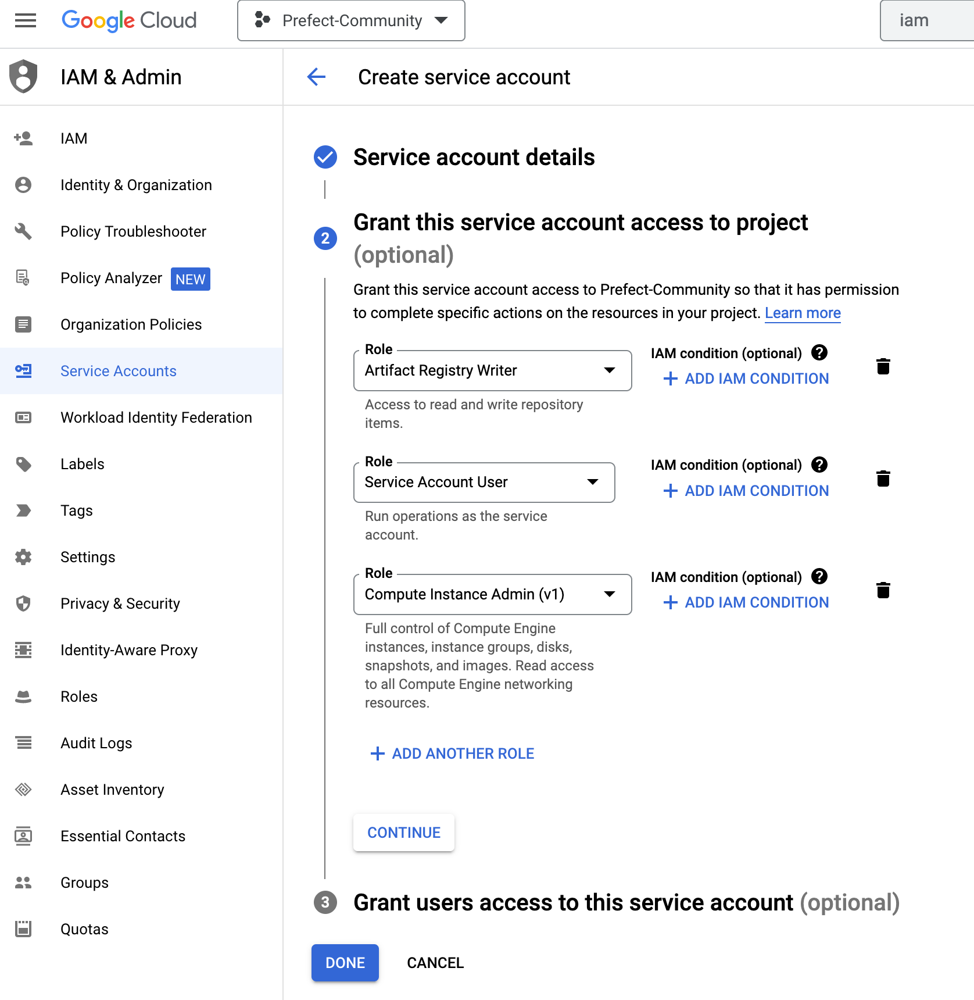
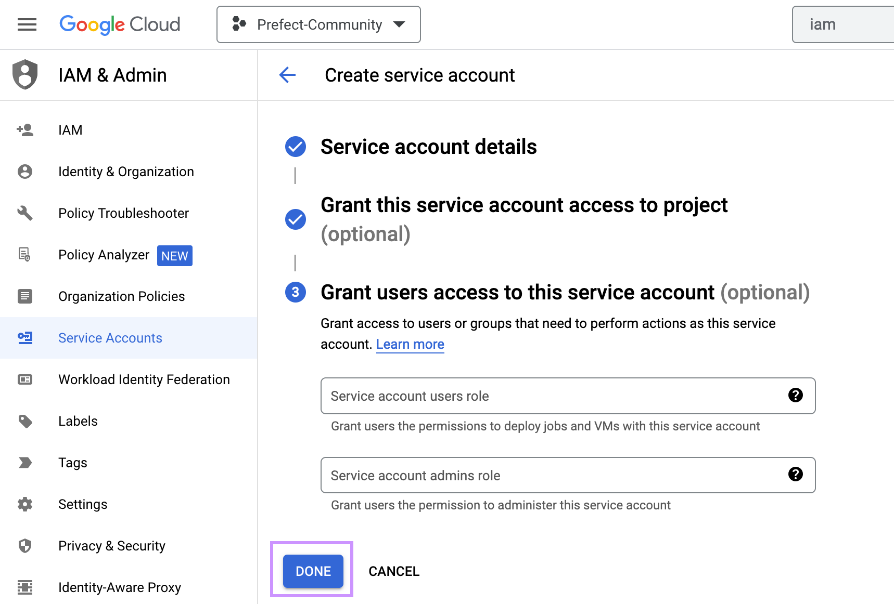
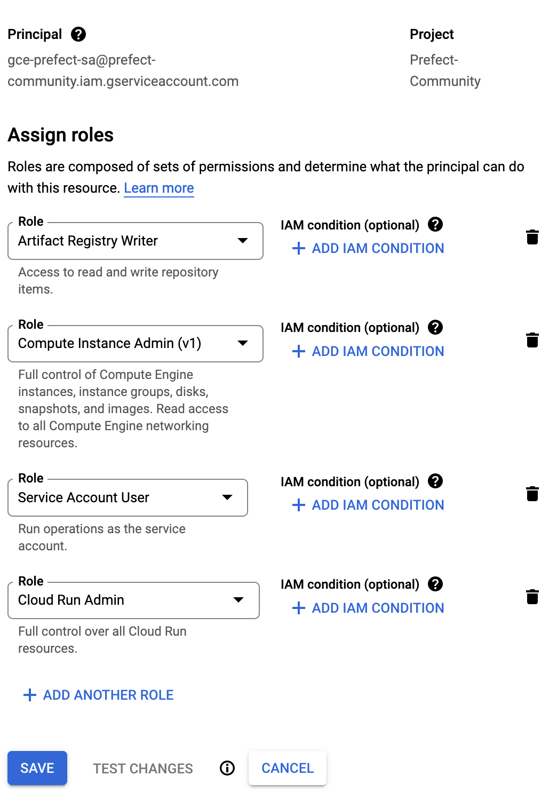
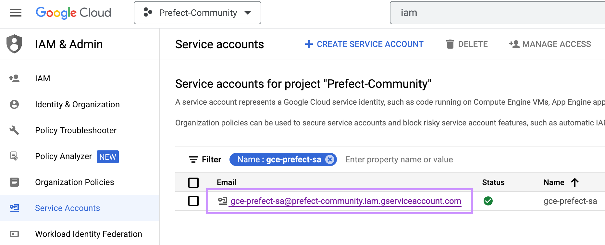
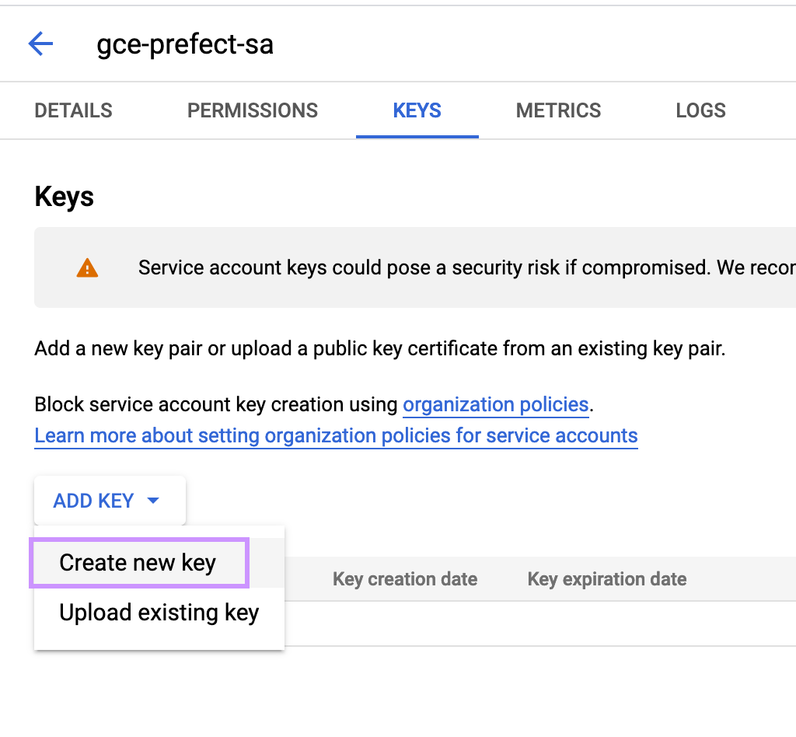
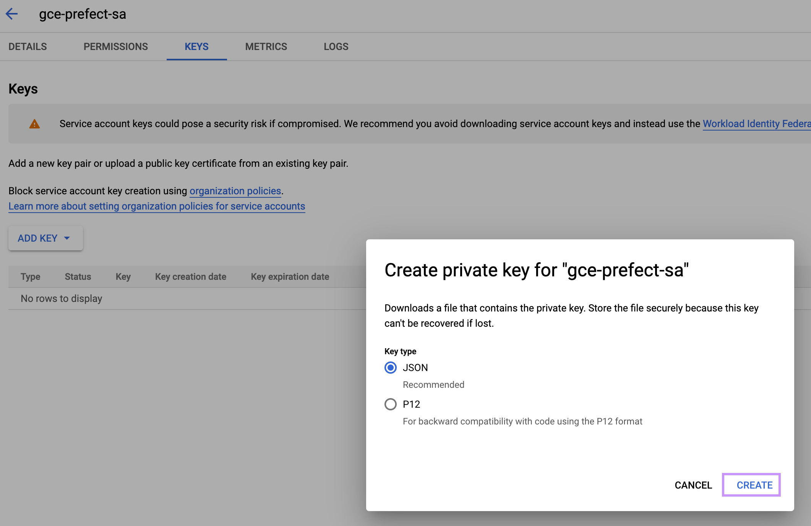

# Create a Service Account

In the Google Cloud Console, select "IAM & Admin" then "Service Accounts". At the top, select "CREATE SERVICE ACCOUNT". We will use the name "gce-prefect-sa". Then select "CREATE AND CONTINUE". At the next step select the following roles to add: 
- Artifact Registry Writer, 
- Service Account User, 
- Compute Instance Admin (v1)
- Cloud Run Admin (admin needed because we need all operations: create/execute/read/delete a job, as well as to retrieve logs) - the Cloud Run Developer doesn't have sufficient permissions.

Keep track of the service account email address (will look something like gce-prefect-sa@PROJECT-ID.iam.gserviceaccount.com").

email: gce-prefect-sa@prefect-community.iam.gserviceaccount.com

In the end, it should look as follows:

Look for your new service account in the table, and select "Manage keys" from the kebab menu at right. Select "ADD KEY", then "Create New Key". For key type, select JSON, then "CREATE". The JSON file should download to your computer. Keep that safe and we will use it later.

# GitHub Action Secrets
IN your GitHub repo, click "Settings" then, under Security, "Secrets", then "Actions". At the top, click the "New repository secret" to create the following secrets:

- GOOGLE_CLOUD_SA_KEY - Open the JSON key file created above. Then copy/paste the entire text into the secret.
- GCE_SERVICE_ACCOUNT_EMAIL - the email address for the service account.
- PREFECT_API_KEY - Your API key from Prefect. Click your profile on the lower left. Then click "API Keys". Create a new key.
PREFECT_API_URL - your Prefect Cloud workspace URL. It will be in the form https://app.prefect.cloud/account/[ACCOUNT-ID]/workspace/[WORKSPACE-ID]

